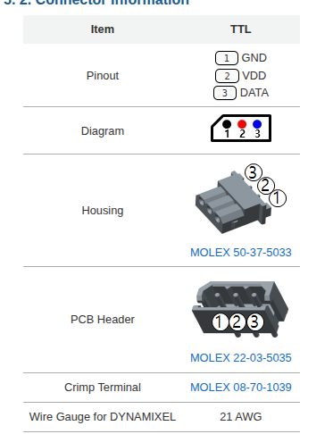

# TTL

Пример: <https://emanual.robotis.com/docs/en/dxl/ax/ax-12a/>

## Проверка работоспособности

1. Подключить U2D2 к одному разъему
2. Подключить питание (12 В) к другому разъему
3. Скачать приложение <https://emanual.robotis.com/docs/en/software/dynamixel/dynamixel_wizard2/>
4. Запустить сканирование

## Запуск без U2D2

### Arduino:

1. Библиотека HalfDuplexSerial - команды формировать вручную по протоколу
2. По использовать 74LVC2G241 (NC7WZ241) + библиотека Dynamixel (не проверял)

### STM32

Реализовать HalfDuplexUART и слать команды

## Ссылки

Мотор: <https://emanual.robotis.com/docs/en/dxl/ax/ax-12a/>

Протокол: <https://emanual.robotis.com/docs/en/dxl/protocol1/>

U2D2: <https://emanual.robotis.com/docs/en/parts/interface/u2d2/>

Приложение: <https://emanual.robotis.com/docs/en/software/dynamixel/dynamixel_wizard2/>